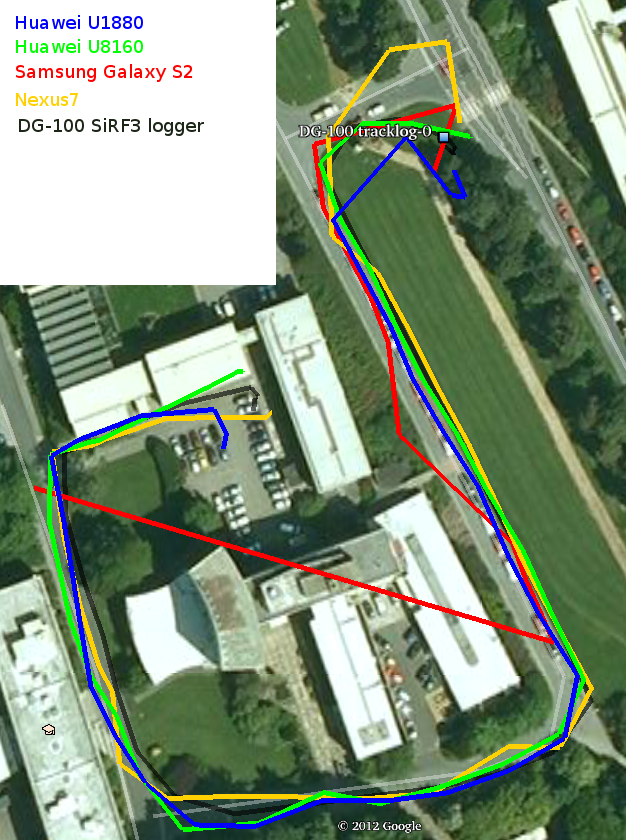
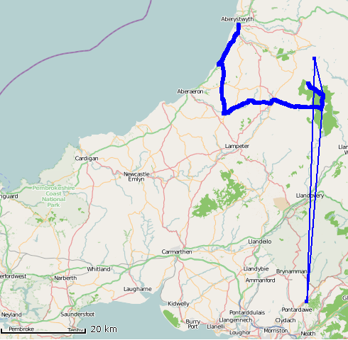

# Parts needed
 * Arduino
 * USB serial converter (TTL)
 * USB RS232 converter
 * GPS receiver (serial)
 * HMC6352 or 6343 compass
 * rotary wind sensor
 * ultrasonic wind sensor
 * 12V PSU
 * oscilliscope
 
 
# GPS

US satellite navigation system, also known as Navstar

medium earth orbit (20,000km height) satellites

calculates time difference between you and each satellite

calculates 3D position (lat, lon, altitude) based on this.

accurate to around 5m in good conditions
altitude less accurate, around 10m

needs clear view of the sky and 4+ satellites
you should get around 10 on a good day outdoors

almanac (approx positions) and ephemeris data (more accurate) tell us which satellites to look for. Transmitting full info takes 12.5 minutes. A full "cold fix" can take this long to obtain.

EGNOS/WAAS geostationary satellites provide corrections based on ground error measurements, 15m down to 5m accuracy. Broadcast to whole continent. 

DGPS sends local correction over VHF radio. Many recievers can't handle this. Can be done over internet or with own hardware.
Accurate to a few cm.

Dual/tri/quad mode Galilelo, Glonass and BEIDOU receivers augment with GPS. under 4m ish accuracy. Getting more common but not standard yet.

## Serial Ports

Most GPS receivers (and loads of other things) send data over serial ports also known as UARTs (universal asynchronous receiver transmitter). 

These: 

* send data one bit at a time. 
* sends data from a device to computer or other way round.
* data rates of 110 to 115200 bits per second
* no separate clock signal, data is the clock
* Seperate transmit and receive lines. 
* We must connect the PC's transmit line to device's recieve and vice-versa.
* Sometimes done in the connector/cable or sometimes by the hardware.
* High voltage is a one, low voltage a zero.

Idle at high state. One bit low to start a byte. 7 or 8 data bytes. One bit high and back to idle to end it.

Typically 5V or 3.3V signals on microcontrollers.

Sometimes handshaking lines are uesd to show we've got data to send or are ready to recieve it. This is optional, often not used for things like GPS. 

* Arduino and Raspberry Pi both have hardware serial port support. 
* Software serial ports can be made by writing software which sets pins high/low at the right time or read's their state. 
* USB serial converters common for Raspberry Pi, the Arduino and Xbee boards have one built in.

### RS232

* Heavier duty version of serial, 9 and 25 pin versions.
* Dates back to 1960s for teleprinters and terminals
* Found on PC's until around mid 2000s
* Still used in lots of industrial equipment, point of sale terminals
* Voltages negative and positive. Keeping average voltage at/near zero makes it less interference prone, better for longer distances.
* Logic is inverted, negative means one and positive means zero!
* Sometimes 0v is used instead of a negative voltage (cheap knock off hardware). Voltages anything from 5 to 12V.
* A chip called a MAX232 will convert RS232 singals to 3.3V or 5V signals and invert them. 

## NMEA

North American Marine Electronics Association

NMEA0183 standard defines data used in boat electronics, like GPS receivers. 
Typically RS232 cabling, today its often behind a USB converter.

Data format 

Starts with a $

Two characters show which device is "talking".  GP means GPS, HC or HD compass/heading sensor, II wind sensor

Next 3 characters show what kind of data this is.

in GPS GGA gives position. VTG speed. RMC speed and position. Lots of overlapping data sentences.
Most GPS units send 5 or 6 sentences once a second or 5 times per second. Sometimes this is configurable.
Typical baud rate 4800, sometimes configurable. 
There are other vendor specific data formats, virtually all receivers support NMEA and use it out of the box.

Data is comma separated ends with a * and a checksum

`$GPGGA,HHMMSS.SSS,DDMM.MMMM,N/S,DDDMM.MMMM,W/E,Fix type,Number of sats,HDOP,Altitude,Geoid height,DGPS update time,DGPS reference*Checksum`

`HH = Hours`

`MM = Minutes`

`SS.SSS = Seconds`

`DD = degrees (longitude)`

`MM.MMMM = Minutes (longitude)`

`N/S = Northern or Southern Hemisphere`

`DDD = degrees (latitude)`

`MM.MMMM = Minutes (latitude)`

`E/W = Easter or Western Hemisphere`

`Fix type 0 = invalid,1 valid GPS, 2 valid DGPS`

`Number of satellites in use`

`HDOP = horizontal dillution of precision, should be under 2(ish)`

`Altitude = metres above mean sea level`

`Geoid height = Height difference between ellipsoid (perfectly round) and geoid (jaggedy model shape)`

`DGPS update time = usually empty as we don't have DGPS`

`DGPS reference = as above`

`Checksum = calculatd by XOR'ing all characters except the $ together.`

`$GPGGA,182214.000,5224.9494,N,00403.9385,W,1,04,2.1,91.3,M,51.2,M,,0000*79`

`Time = 18:22:14 `

`Latitude = 52 degrees, 24.9494 minutes North`

`Longitude = 4 degrees, 3.9385 minutes West`

`Valid fix`

`4 satellites`

`2.1 HDOP`

`91.3M above sea level`

`Geoid is 51.2M above elipsoid`

`no DGPS data`

`79 checksum`

NMEA strings reference see http://aprs.gids.nl/nmea/
Online string decoder https://rl.se/gprmc

No need to write your own code to read this. GPSD on Linux does it for you! TinyGPS/TinyGPS++ libraries on Arduino

See [Sparkfun GPS tutorial](https://learn.sparkfun.com/tutorials/gps-basics)

# Compass

Senses the earth's magnetic field to find the direction to north. Our compass is a Honeywell HMC6343. It costs about £100 but works well. The HMC5883 and 6352 are cheaper and simpler versions.

Magnetic north isn't true north. Its constantly moving and different offsets needed in different places. Check it at [magnetic-declination.com](http://www.magnetic-declination.com/)

Aberystwth about -2 degrees, East coast USA -15, West coast +13
Big enough that we should compensate for it.

## I2C

* Two wires, clock (SCL) and data (SDA) plus ground. Master generates clock. 
* Only a master can initiate communication. It sends slave device address, register address. Device replies with data. 
* Multidrop, every slave device has its own address
* Addresses are 7 bit,0-127. Eighth bit controls if we are doing a ready or a write. Confusion often originates from whether addresses in datasheets are for 7 or 8 bits, there is no consitency!
* Also known as TWI, Two Wire Interface.
* Arduino and Raspberry Pi both have hardware I2C support.

More info [Sparkfun I2C tutorial](https://learn.sparkfun.com/tutorials/i2c)

## Tilt compensation

 * Simple compass sensors (hmc6352) only sense the magnetic field in one direction. When they tilt the heading changes. 
 * 3 axis (hmc5883) sense magnetic field in three directions. You need to do calculations to convert 3 fields into a heading.
 * Decent sensors calculate heading for you, might also add accelerometer and gyro sensors to improve accuracy of tilt estimate. The HMC6343 uses accelerometers. 
 * Some sensors need to be placed flat when they startup. What if the compass reboots at sea?
 
# Wind sensors

* Senses wind direction 
* A simple rotary potentiometer works, resistance varies with heading.
* Needs to rotate continuously. Most potentiometers have a null point where they stop conducting. Most are logarithmic, not linear. 
* Water and salt gets into the pot easily.
* Magnetic sensor, effecitvely a compass
* Magnet on the end of a shaft, layer of epoxy between sensor and magnet. 

## PWM
* Austria Microsystems AS5040 sensor
* Pulse Width Modulation output
* Time spent high vs low shows value
* 0% on = 0 degrees
* 50% on = 180 degrees
* 100% on = 359 degrees
* pulse lasts 1ms 
* Measure how long its high vs low. Pulse length = high time / 1ms. Multiply by 360 for degrees

## Ultrasonic sensors
* Ultrasonic sound's time of flight altered by the wind
* Measure difference between send and receive time. One transmitter, two receivers for x and y.
* Sensors expensive, £500+
* Good accuracy, works well in low wind.
* Somewhat power hungry, 100mA, 12V
* Heavyish, don't want extra weight at mast head
* Often placed on their own pole nearer the deck. Distrubed by sail.
* NMEA0183 output
* Airmar sensors combine compass, wind sensor and GPS in one unit
* We have one for Kitty

## Filtering wind data
* Inherently noisy
* If we try to average we get problems around north. (359 + 1 ) / 2 = 180,should equal 0
* Average sine and cosine separately. We use a decaying average. 

s += (sin(wind_direction) - s) / r
c += (cos(wind_direction) - c) / r

