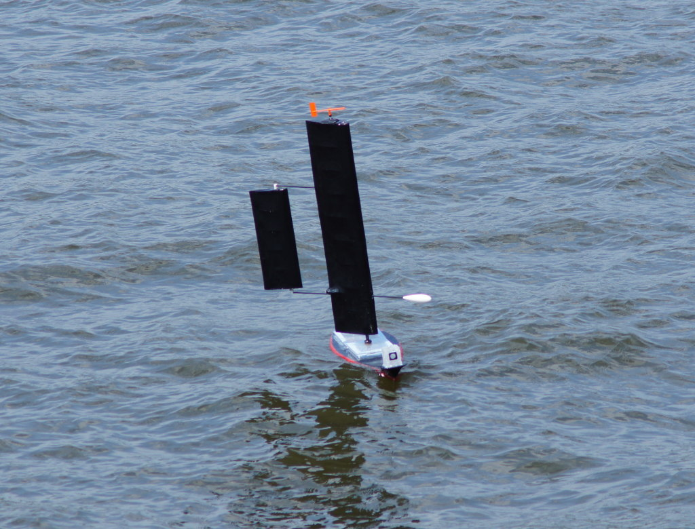

# Parts of the boat

## Rigging Dewi

Rigging Instructions Videos:

 * [Part 1](https://www.youtube.com/watch?v=ZN1mIDve0pk)
 * [Part 2](https://www.youtube.com/watch?v=c_wlABofnBg)
 * [Mast removal instructions](https://www.youtube.com/watch?v=ZqXYH8u4nAE)

# Points of sail

[Points of Sail video](https://www.youtube.com/watch?v=tYo5tvojU0I)

##  Polar Diagrams

### Same data in linear graph

## Tacking
Zig Zagging to travel upwind.

### Downwind tacking
Sailing straight down wind can be unstable, lots of rudder input required to keep on a straight line. Boom may inadvertently swing across in a gybe. Safer to sail on a broad reach and tack/gybe occasionally. 

### Goose swinging
Putting the jib and main on opposite sides while sailing downwind. More stable and the main doesn't block the jib. Known as "wing on wing" by Americas.

## Reefing
Making the sail smaller for strong wind conditions. Usually the sail is wrapped around the boom.

# Wing Sails
## Direct drive
Active control needed, power hungry,needs constant computer attention

### Wing sails are hard to reef

## Tailed wing sails
Steering a small tail sets the target sail position. Sail passively keeps itself in position.

  
## Asymetric wing
only works on one tack, ok for sailing a long way in the same direction

  
## Sail size trade off
bigger sail = more power, but more heeling
transatlantic boats often keep sails extra small
  
# Hull design
narrower and longer = faster
wider = more stable
heeling over slows you down
let sail out as you heel,our control system doesn't do this (yet)

## Keels
deeper keels keep boat upright better
harder to operate in shallow water, more drag
detachable better for transport
point of weakness

## Mast
taller mast gets cleaner winds
pushes you over more

