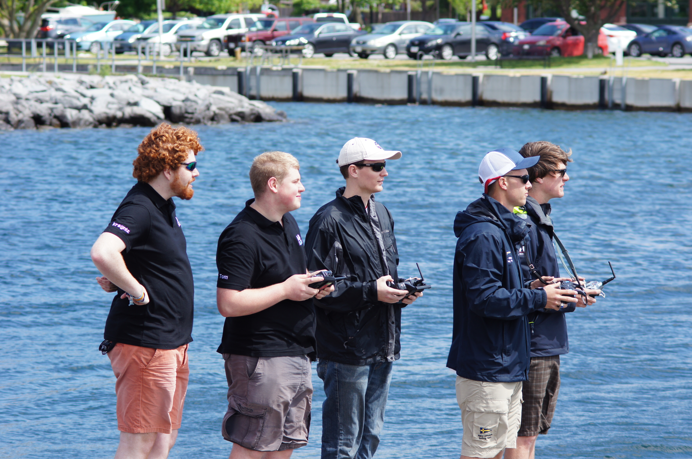

# Panopto Recording

# Radio Basics
* Electromagnetic wave
* Frequency from KHz to GHz. Wavelengths kilometres to centimetres. Equivalent to colour.
* Wavelength determines propagation properties. Low frequencies generally propagate further for same power.
* Bandwidth = amount of frequency space allocated, harder to allocate much space at lower frequencies
* Modulation, changing the radio signal to convey data.
* Continuous wave, turn signal on/off
* AM, vary amplitude
* FM, vary frequency
* PM, vary phase
* QAM, vary phase and amplitude

## Frequency allocations
* OFCOM allocates UK frequency use. Illegal to transmit on a frequency you aren't licensed to use.
* A handful of frequencies are unlicensed. 
* 433 MHz, "low power device" allocation, 10 milliwatts only, up to 100 mW in other parts of Europe. Not available in USA/Canada. 
Used in remote controls, wireless temperature sensors, 
* 868 MHz, "short range device" allocation, up to 500 milliwatts, transmit only 10% of the time. Available in some of Europe. Not US/Canada.
* 2.4 GHz, "industrial, scientific and medical" band. Used for WiFi, bluetooth, Xbee, remote controls, microwave ovens! Mostly common worldwide, UK/EU band slightly wider than US/Canada. 500mW power limit.
* 5.8 GHz, "ISM" band. Also used for WiFi, but not universally supported. Also used for video transmission from FPV drones. 100mW power limit
* 915 MHz, American equivalent of 433/868. Mobile phone frequency in Europe, don't use 915 MHz equipment here!

# Radio systems
## Xbee
* Medium range (1km), medium bandwidth (up to 250kbps), packet or virtual serial link
* Can be turned into a mesh, pre-designated coordinators, repeaters and end nodes.
* Remotely read/control I/O pins
* 2.4 GHz or 868/915 MHz versions available
* Fairly expensive, £45+ per module

## WiFi
* Short range (a few hundred metres), high bandwidth (1-300 mbps), full network stack
* Various hacks to turn into a mesh or repeat signal. Significant problems with some of these.
* Nearly universal, cheap £5 for a USB module

## LoRA

* Very low bandwidth ( 250 to 5470 bits per second), low power, long range (10s of kms)
* Very clever chirp modulation, varies frequency as it transmits. Good noise immunity.
* Intended for IoT scenarios with small numbers of base stations per city, lots of devices reporting. e.g. power meters
* proprietary patented protocol, open source reverse engineering see https://revspace.nl/DecodingLora

## GSM/UMTS/LTE
* Mobile phone systems, long range (10s of KMs), low to high bandwidth (10kbps to 100 mbps)
* Telemetry via SMS text message or over the internet
* Networks don't like you sending thousands of SMS messages
* Data charges, especially when roaming
* Relies on 3rd party network, coverage needed
* Communication modules interfaced via a serial port, USB or WiFi.
* Full TCP/IP stack or AT commands

## Radio control system
* 2.4 GHz handheld unit

# Telemetry Software and Protocols
## Mavlink
* Binary protocol for drone communication.
* Basically a clever way to send a data structure over a network.
* Code to convert an XML message definition to code.
* Some common message formats pre-defined. See [mavlink example](https://en.wikipedia.org/wiki/MAVLink#Messages)
## APMplanner2
* Mavlink ground station for drones.
* Can send waypoints or read waypoint list from drone. Boatd doesn't fully support this yet.
!(APMPlanner2)[https://raw.githubusercontent.com/abersailbot/media/master/presentation/photos/telemetry.jpg]

## NMEA
* Standard format for marine electronics. Lots of software to decode it.
* Handles location (GPS), compass heading, wind direction, waypoints etc.

## OpenCPN
* Chart plotting program for boats
* Displays NMEA data from GPS, compass, wind sensors etc.
!(opencpn)[opencpn_ais.png]

### Try it yourself
(Download OpenCPN)[https://www.opencpn.org/OpenCPN/info/downloadopencpn.html]

#### Configure a new data source
* open OpenCPN
* Go to Tools->Options->Connections
* Click Add Connection
* UDP, address 0.0.0.0, DataPort 10000 (for Wifi)
* With Xbee connected, use Serial, choose the Xbee device from the DataPort dropdown (e.g. /dev/ttyUSB0 on Linux) and Baudrate 9600.

#### Add some maps

* Download a (map of Aber)[https://github.com/abersailbot/maps/raw/master/Aberystwyth_North-Centre.kap]
* Save it to your computer, OpenCPN might have created a Charts directory in your home directory.
* Go to tools->options and choose Charts. 
* Click Add Directory and add the directory you saved the map to. 
* Click Apply and it should add the map, when you zoom in on Aberystwyth you should see a proper map.
* More maps are available in the (maps repository on our github)[https://github.com/abersailbot/maps].
